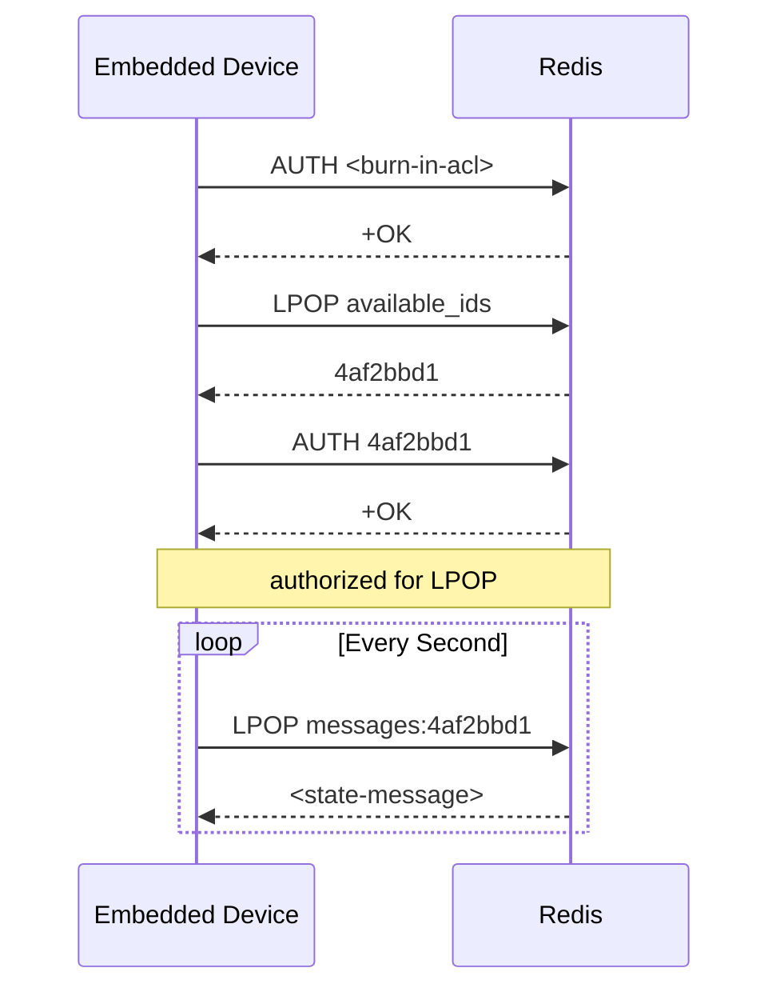

# General Platform Architecture

### Device Authorization

In order for devices to receive messages, they must first authenticate with the redis service,
which is what we're using to act as a message broker. This authentication scheme is handled by
using redis ACL entries, with a global provisioning ACL burned into devices during firmware
flashing.

[← README](../../README.md)
