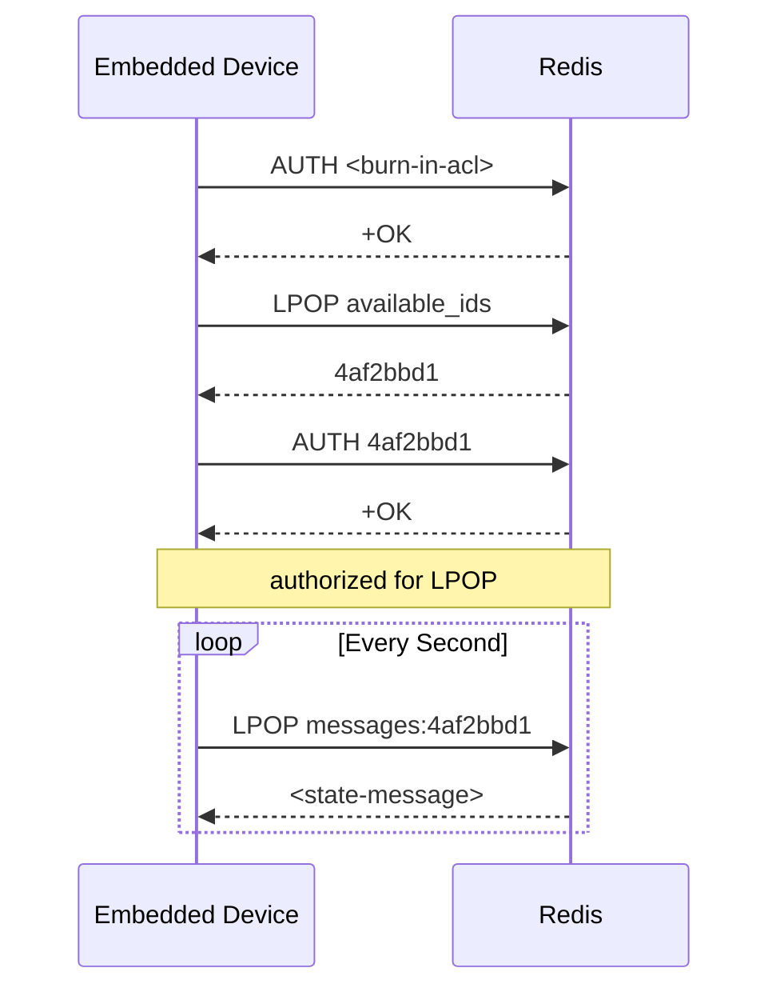

# General Platform Architecture

At a high level, the architecture of the platform is based on four components - a web backend,
a web frontend, and the individual devices, with a redis database being leveraged as a message
broker and authentication system for the devices:

### Device Authorization

In order for devices to receive messages, they must first authenticate with the redis service,
which is what we're using to act as a message broker. This authentication scheme is handled by
using redis ACL entries, with a global provisioning ACL burned into devices during firmware
flashing.

[← README](../../README.md)
